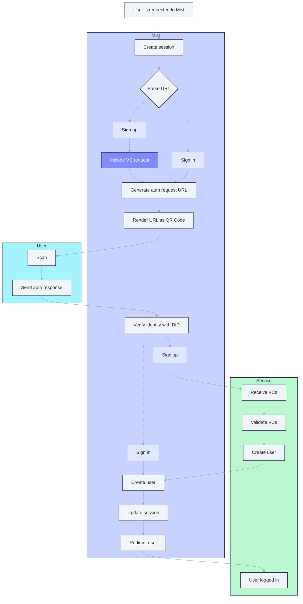

Mist follows a traditional OIDC redirect flow, with the exception that no third party is needed to verify the user's identity.

```mermaid
%%{
  init: {
    'themeVariables': {
      'lineColor': '#94a3b8'
    }
  }
}%%

flowchart TD
  Start[User is redirected to Mist]

  subgraph Service
    SReceive[Receive VCs]
    SValidate[Validate VCs]
    SUser[Create user]
    SDone[User logged in]
  end

  subgraph Mist
    MSession[Create session]
    MUrl{Parse URL}
    MUp[Sign up]
    MIn[Sign in]
    MOIDC[Generate auth request URL]
    MOIDCWithVCs[Include VC request]
    MQR[Render URL as QR Code]
    MVerify[Verify identity with DID]
    MUser[Create user]
    MUpdateSession[Update session]
    MRedirect[Redirect user]

    MLSignUp[Sign up]
    MLSignIn[Sign in]
  end

  subgraph User
    UScan[Scan]
    URespond[Send auth response]
  end

  Start --> MSession
  MSession --> MUrl
  MUrl -.-> MIn
  MUrl -.-> MUp
  MUp --> MOIDCWithVCs --> MOIDC
  MIn --> MOIDC
  MOIDC --> MQR
  MQR --> UScan
  UScan --> URespond
  URespond --> MVerify
  MVerify -.-> MLSignUp --> SReceive
  SReceive --> SValidate
  SValidate --> SUser
  SUser --> MUser
  MVerify -.-> MLSignIn --> MUser
  MUser --> MUpdateSession
  MUpdateSession --> MRedirect
  MRedirect --> SDone

  classDef node fill:#f1f5f9,stroke:#020617;
  classDef user fill:#a5f3fc,stroke:#020617;
  classDef app fill:#f8fafc,stroke:#020617;
  classDef mist fill:#c7d2fe,stroke:#020617;
  classDef service fill:#bbf7d0,stroke:#020617;
  classDef includeVCs fill:#818cf8,color:#eef2ff,stroke:#1e1b4b;
  classDef mistLabel fill:#e0e7ff,color:#1e1b4b,stroke:#e0e7ff;

  class User user;
  class App app;
  class Mist mist;
  class Service service;

  class MOIDCWithVCs includeVCs;
  class MUp,MIn,MLSignUp,MLSignIn mistLabel;
```
