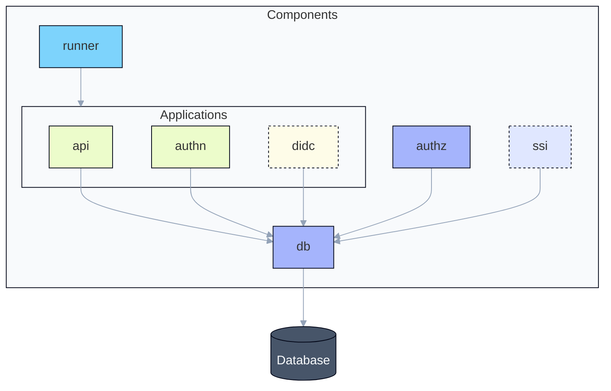

Mist is built as what's sometimes called a **modular monolith**. The opaque nodes in the following flowchart
indicate a future component.

## Components

Each component is a Rust crate that lives in the Mist monorepo.

| Component  | Description                                                                              |
| ---------- | ---------------------------------------------------------------------------------------- |
| **runner** | The entry point, responsible for starting apps from components that export axum routers. |
| **api**    | The REST API, used by the Service to manage the Mist instance.                           |
| **authn**  | The authentication service, responsible for user authentication.                         |
| **db**     | The data layer, used by all components to store data.                                    |
