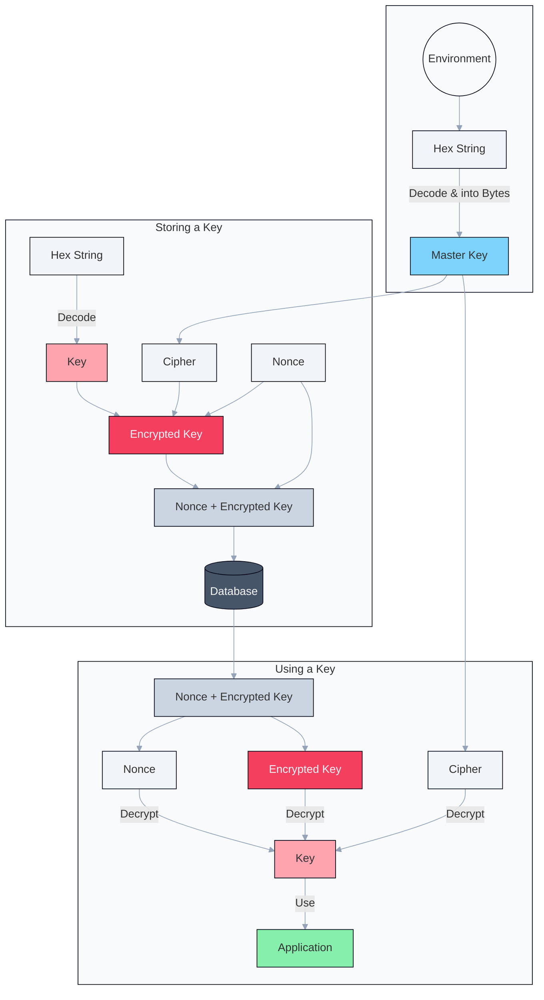

**Service keys** are used to sign and verify pieces of the authentication flow.
They are stored in the database encrypted with a **master key**.

```mermaid
%%{
  init: {
    'themeVariables': {
      'lineColor': '#94a3b8'
    }
  }
}%%

graph TD
  Database[(Database)]

  subgraph master[" "]
    Environment((Environment)) --> MasterHex
    MasterHex[Hex String] -->|Decode & into Bytes| MasterBytes[Master Key]
  end

  subgraph storing[Storing a Key]
    SKeyHex[Hex String] -->|Decode| SKey[Key]
    MasterBytes --> SCipher[Cipher]
    SNonce[Nonce]
    SCipher & SNonce & SKey --> SKeyEncrypted[Encrypted Key]
    SNonce & SKeyEncrypted --> SCombined[Nonce + Encrypted Key]
    SCombined --> Database
  end

  subgraph using[Using a Key]
    Database --> UCombined[Nonce + Encrypted Key]
    UCombined --> UNonce[Nonce]
    UCombined --> UKeyEncrypted[Encrypted Key]
    MasterBytes --> UCipher[Cipher]
    UCipher & UNonce & UKeyEncrypted -->|Decrypt| UKey[Key]
    UKey -->|Use| Application
  end

  classDef group fill:#f8fafc,stroke:#020617;
  classDef node fill:#f1f5f9,stroke:#020617;
  classDef environment fill:#f8fafc,stroke:#020617;
  classDef masterKey fill:#7dd3fc,stroke:#020617;
  classDef encryptedKey fill:#f43f5e,stroke:#020617,color:#f8fafc;
  classDef decryptedKey fill:#fda4af,stroke:#020617;
  classDef combined fill:#cbd5e1,stroke:#020617;
  classDef database fill:#475569,stroke:#020617,color:#f8fafc;
  classDef application fill:#86efac,stroke:#020617;

  class master,storing,using group;
  class Environment environment;
  class Database database;
  class MasterBytes masterKey;
  class SKeyEncrypted,UKeyEncrypted encryptedKey;
  class SKey,UKey decryptedKey;
  class SCombined,UCombined combined;
  class Application application;
```
